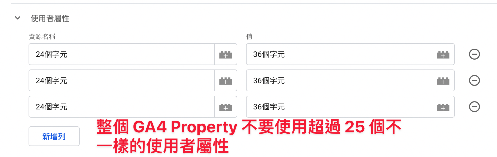

 

 ---

這邊介紹的都是以 GA4 免費版本的限制為主，如果你們的使用量真的遠超過這些限制，就會建議升級到 GA360 版本 !

單位註記 :
位元 Character, 一個英文單字就是一位元

---

# 事件的限制 Event

## 事件名稱 Event Name

40 個位元

## 每個事件可以追蹤的事件參數 Event Parameter per Event

25 個參數

## 事件參數名稱 Event Parameter Name

40 個位元

## 事件參數值 Event Parameter Value

100 個位元

## Event 限制總結

```javascript
window.dataLayer.push({
    event : "40個字元",
    event_parameter_40個字元_1 : "parameter_value_100個字元",
    event_parameter_40個字元_2 : "parameter_value_100個字元",
    event_parameter_40個字元_3 : "parameter_value_100個字元",
    ...
    event_parameter_40個字元_24 : "parameter_value_100個字元",
    event_parameter_40個字元_25 : "parameter_value_100個字元"
    // 25個欄位，不能再多
})
```

---

# 使用者欄位 User properties

25 個 Properties / 1 個 GA4 Property

## 使用者欄位名稱

24 個字元

## 使用者欄位值

36 個字元

## User-ID

256 個字元

## User Property 限制總結



# 語言問題 英文 vs 中文

目前測試起來中文應該也是算一個字元，[Google 文件](https://support.google.com/analytics/answer/9267744?hl=en) 中只有特別提到日文可能會是每個字佔兩個字元

但還是建議大家在這邊還是都使用英文為主，畢竟未來這些蒐集到的資料除了報表上閱讀。
可能還會有 Data Team 或是其他資料運算或分析用途時，中文字元就會造成未來很多的麻煩等等。