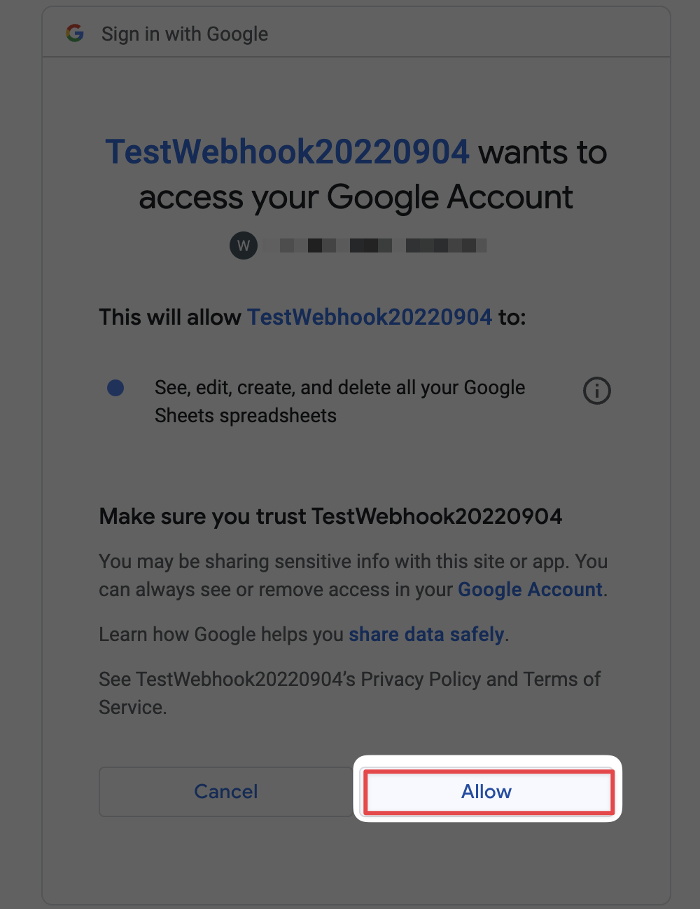

 
 

---

# API vs Webhook

先簡單說明一下 API 和 Webhook 的差異，API 是當你有取得資料的需求時，主動去詢問資料，並等待結果。
上述圖片的場景為 : 你想要知道現在會不會下雨，所以你用 API 去問氣象局說會不會下雨，設定每小時問一次。
這種作法在取得一些無法確定或肯定的數據時，會顯得效率不彰或是浪費很多 request 資源。

這時候就有了 webhook 的做法，直接和對方設定在符合某個條件時，
直接通知你該事件的事發生 : 
以圖片為例，就是請氣象局在發大雨特報時主動通知你，
這麼一來你就再也不用每個小時發一個 request 去詢問了!

另一種我們很有感的 webhook 就是地震國家警報
 
任何警報類型的場景都很適合 webhook，當和其他系統在討論串接時，也要記得 webhook 的存在並詢問對方是否有這種機制
較常發生的情境有 : 
- 成立訂單
- 註冊會員
- 系統錯誤
- 當使用者完成特定事件
等等

這些場景使用 API 都會有可能是大量的浪費，因為大部分的詢問可能都沒有最新結果或是你要的結果。

---

# 用 Google App Script 測試 Webhook

當我們要測試 webhook 時，通常需要有一個 Endpoint 來接收這些資料，並解析裡面的 payload 後撰寫相對應的 code 來處理。

有一些簡單好用的網站即可滿足這個需求
[Webhook Site](https://webhook.site/)
| 但最近他怪怪的有時候會有憑證問題連不上
[RequestBin](https://requestbin.com/)

但今天當你要測試的資料你不放心拋到第三方的網站上，或是今天你不想從頭架設一個 Server 來接收資料等等(因為很多 Webhook Endpoint 會要求 HTTPS 憑證，對沒用過的人來說可能相對麻煩)。 Google App Script 在這點上就算是相當方便。

---

## 建立一個 Google Sheet 和 Google App Script

 
通常也可以直接建立一個空白的 Google App Script，但今天這場景會把資料寫入在 Google Sheet 上，所以我直接從 Google Sheet 上建立一個 Google App Script。

 
新建立好的 Google App Script 會有一隻預設的檔案，副檔名為 gs 檔，並且內建一個 myFunction

---

## doGet & doPost function

doGet 對應到的就是 GET method 的 request，doPost 就是相對應 Post method
這兩個 function 的參數我們暫定為 e :r
[Google 對於該參數的文件](https://developers.google.com/apps-script/guides/web#request_parameters)

常用到的有
- e.parameters
| 例: name=alice&n=1&n=2
- e.parameter
| 例: {"name": "alice", "n": "1"}
- e.queryString
| 例: {"name": ["alice"], "n": ["1", "2"]}
- e.postData.contents
| 例: text/csv
- e.postData.type
| 例: Alice,21

簡易的範例程式碼如下
```javascript
function doGet(e) {
  var params = JSON.stringify(e);
  return HtmlService.createHtmlOutput(params);
}

function doPost(e){
  var params = JSON.stringify(e);
  return HtmlService.createHtmlOutput(params);
}
```

---
## 將得到的參數資料存入 Google Sheet

上面的範例程式碼只是將參數們直接回傳在 response 上，但很多時候我們可能想要找個地方存起來當紀錄，這時 Google Sheet 就是一個方便的資料庫。

所以這邊修改和增加了程式碼如下
```javascript
function doGet(e) {
  var params = JSON.stringify(e);
  writeToSheet("Get", params);
  return HtmlService.createHtmlOutput(params);
}

function doPost(e){
  var params = JSON.stringify(e);
  writeToSheet("Post", params);
  return HtmlService.createHtmlOutput(params);
}

function writeToSheet(type, data){
  // SpreadSheet ID
  const ssApp = SpreadsheetApp.openById("1f5_LL4mB0NRDEAM23IGglPbbVHD-??????????");
  // SpreadSheet sheet name
  const sheet = ssApp.getSheetByName("log")
  sheet.appendRow([type, data]);
  return true
}
```


如何尋找 SpreadSheet ID 和 Sheet Name

---
## 部署 Google App Script

部署的步驟圖多，盡量用圖片解釋




這邊的網址就是 webhook 的 endpoint，可以開始測試 Get 和 Post 的 Request 了!

---
## 測試 Endpoint 和 GSheet 是否成功

這邊用 PostMan 測試自己的 endpoint


可以看到 Google Sheet 上有正確的紀錄 Post 的相關資料了!
