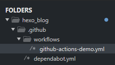

第一篇在 [Hexo](https://hexo.io/) 上面的文章，未來會慢慢寫下建置心得以及一些使用心得。

---

### Theme 如何挑選

官方文件中提供的模板有很多 [連結](https://hexo.io/themes/)
但建議還是都先找一下該 Theme 的 Github 連結來確認一下使用者的人數和維護的日期，
畢竟 Hexo 本身也有在更新，如果用到沒有跟著更新的主題可能未來就會有相容性的問題。
> 這邊也會想一下是否要寫個爬蟲來實現 Github 的 Star 數和最後更新日期的清單
> 有找到 Github 可以用API 來取得 Repository 的相關資料。麻煩的地方在 Last Commit 要打另一隻API
> [Github API - Get Repository](https://docs.github.com/en/rest/repos/repos#get-a-repository)
> [Github API - List Commits](https://docs.github.com/en/rest/commits/commits)

---

### 如何安裝 Google Tag Manager

目前這個網站使用的 Theme 是 [Next](https://github.com/theme-next/hexo-theme-next)
安裝 GTM(Google Tag Manager) 和 GA(Google Analytic) 的方式類似，
檔案在 ```.\themes\next\layout\_third-party\analytics\google-analytics.swig```

我的作法是遵照 Theme 設定 GA 的方式，透過 config 來判斷是否要載入:

```

<!-- Google Tag Manager -->
<script>(function(w,d,s,l,i){w[l]=w[l]||[];w[l].push({'gtm.start':
new Date().getTime(),event:'gtm.js'});var f=d.getElementsByTagName(s)[0],
j=d.createElement(s),dl=l!='dataLayer'?'&l='+l:'';j.async=true;j.src=
'https://www.googletagmanager.com/gtm.js?id='+i+dl;f.parentNode.insertBefore(j,f);
})(window,document,'script','dataLayer','{{ theme.gtm.gtm_id }}');</script>
<!-- End Google Tag Manager -->

```

> 主題的設定檔案路徑
> .\themes\next\_config.yml

如果在主題的設定檔中有填入
```
gtm:
  gtm_id: GTM-WRZDBFS
```
便會載入這段 GTM 的 script 並替換成相對應的 GTM ID.

---

### 使用 Git Action 自動化部署

這邊可能不是 Best Practice. 
背景原因是租用的機器就是需要 ssh 去連線，如果在 Local 中修改完去推 code.
就要 ssh 連線進去並且再執行一次 git pull.
為了省去這一點步驟，想到 Github 有 Action 可以使用 : 

1. 在專案中 .github 的資料夾建立一個 workflows 的資料夾如圖
<!--  -->


2. 這個 YAML 檔中目前我使用的內容如下
```
name: GitHub Actions Demo
on: 
  push:
    branches:
      - "main"
  pull_request:
    branches: ["main"]

jobs:
  Explore-GitHub-Actions:
    runs-on: ubuntu-latest
    steps:
      - uses: actions/checkout@v2
      - name: deploy to vm
        uses: appleboy/ssh-action@master
        with:
          host: ${{ secrets.HOST }}
          username: ${{ secrets.USERNAME }}
          key: ${{ secrets.SSHKEY }}
          script: |
            cd /xxx/xxx/xxxx/hexo 
            git pull
            hexo clean; hexo generate

```

稍微解釋一下自己理解的內容
**on**
這一段是指說 main 這個 branch 在被 push 或是提交一個 pull_request 的時候會觸發. 
因為我的情境就是需要在我的 Local 端 push 時觸發這個 action

**jobs**
這邊是 action 會開始執行的動作

``` 
- use xxx
```
是指說去應用別人已經寫好的 action，像我這邊用到的 ssh 登入機制就是使用一個名為 appleboy 的使用者建立的 ssh-action@master
[Github 連結 : appleboy/ssh-action](https://github.com/appleboy/ssh-action)

並填入我遠端機器的 host, username, sshkey 等等

**scripts** 就是連線到機器後要下的指令，蠻直覺的
```
cd 到相對應的資料夾
git pull
hexo clean //清除已經產生的靜態檔案
hexo generate //重新產生最新的靜態檔案
```
不用 hexo server 的原因是我使用 nginx 當作 server 了

另外比較重要的是這些 ${{ secrets.xxx}} 該怎麼設定
需要到 Github Repository -> Setting -> Secrets -> Action 來新增，必須小心，這邊新增後就無法檢視原本的內容，更新會是空白的欄位讓你直接更新上去。


設置好後應該就大功告成了，可以在 Local 端 Push 一次
Github -> Repository -> Action 這邊就會顯示 run 的狀態(成功或失敗，和失敗在哪)

